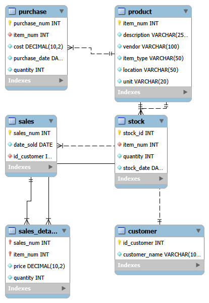

# Greenspot Grocer – Online Grocery Database (MySQL Workbench)
**Coursera Guided Project | 100% Complete**

## Project Overview
Designed and implemented a fully normalized relational database for an online grocery store using MySQL Workbench.

### Features
- 6 normalized tables (3NF)
- Proper primary keys, foreign keys, and relationships
- Sample data loaded (products, customers, purchases, sales, stock)
- Business queries tested (total cost, revenue, customer spending, stock levels)

### EER Diagram

### Query Results
- Total purchase cost per product → query1.png
- Total revenue per product → query2.png
- Customer orders & spending → query3.png
- Current stock levels → query4.png

### Full SQL Script
See `greenspot_complete.sql`

**Skills Demonstrated**  
SQL • MySQL • Database Design • Normalization • ER Modeling • Data Analysis

Completed by: M: Saayid Shah  
Location: Pakistan  
LinkedIn: (www.linkedin.com/in/muhammad-saayid-shah)
